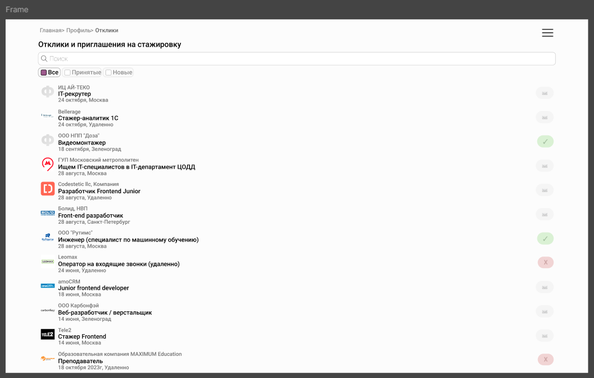
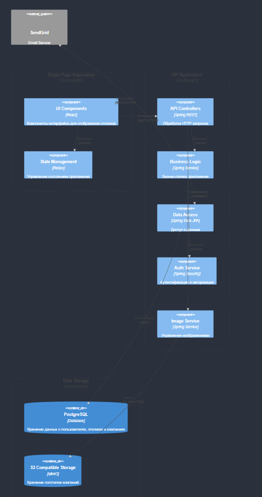

# ТЗ на фронтенд страницы откликов и приглашений на стажировку

## 1. Макет страницы



## 2. SEO

URL страницы: /internship-responses

Хлебные крошки: Главная > Профиль > Отклики

## 3. JSON при инициализации

```json
[
  {
    "company": "ИЛ АЙ-ТЕКО",  
    "position": "IT-рекрутер",
    "date": "24.10.2024",
    "status": 0,
    "location": "Москва",
    "companyLogo": "https://example.com/logos/il-iteco.png"
  },
  {
    "company": "Bellerage",
    "position": "Стажер-аналитик",
    "date": "24.10.2024",
    "status": 0,
    "location": "Удаленно",
    "companyLogo": "https://example.com/logos/bellerage.png"
  },
  {
    "company": "ООО НПП \"Доза\"",
    "position": "Видеомонтажер",
    "date": "18.09.2024",
    "status": 1,
    "location": "Зеленоград",
    "companyLogo": "https://example.com/logos/doza.png"
  },
  {
    "company": "ГУП Московский метрополитен",
    "position": "IT-специалист в ЦОДД",
    "date": "28.08.2024",
    "status": 0,
    "location": "Москва",
    "companyLogo": "https://example.com/logos/moscow-metro.png"
  },
  {
    "company": "Codestetic llc",
    "position": "Разработчик Frontend Junior",
    "date": "28.08.2024",
    "status": 0,
    "location": "Удаленно",
    "companyLogo": "https://example.com/logos/codestetic.png"
  },
  {
    "company": "Болид, НПП",
    "position": "Front-end разработчик",
    "date": "28.08.2024",
    "status": 0,
    "location": "Санкт-Петербург",
    "companyLogo": "https://example.com/logos/bolid.png"
  },
  {
    "company": "ООО \"Рутим\"",
    "position": "Инженер (ML-специалист)",
    "date": "28.08.2024",
    "status": 1,
    "location": "Москва",
    "companyLogo": "https://example.com/logos/rutim.png"
  },
  {
    "company": "Leomax",
    "position": "Оператор на входящие звонки",
    "date": "24.06.2024",
    "status": -1,
    "location": "Удаленно",
    "companyLogo": "https://example.com/logos/leomax.png"
  },
  {
    "company": "amoCRM",
    "position": "Junior frontend developer",
    "date": "18.06.2024",
    "status": 0,
    "location": "Москва",
    "companyLogo": "https://example.com/logos/amocrm.png"
  },
  {
    "company": "ООО Карбонфэй",
    "position": "Веб-разработчик / верстальщик",
    "date": "14.06.2024",
    "status": 0,
    "location": "Зеленоград",
    "companyLogo": "https://example.com/logos/karbofay.png"
  },
  {
    "company": "Tele2",
    "position": "Стажер Frontend",
    "date": "14.06.2024",
    "status": 0,
    "location": "Москва",
    "companyLogo": "https://example.com/logos/tele2.png"
  },
  {
    "company": "Образовательная компания MAXIMUM Education",
    "position": "Преподаватель",
    "date": "18.10.2023",
    "status": -1,
    "location": "Удаленно",
    "companyLogo": "https://example.com/logos/maximum-education.png"
  }
]

```

## 4. Маппинг данных

### Элементы списка откликов/приглашений

Скриншот элемента: [Скриншот элемента в макете]

Условие отображения: Всегда

Описание элемента:

| Элемент | Тип элемента | Поле из JSON | Примечание |
|---------|--------------|--------------|------------|
| Логотип компании | Изображение | companyLogo | Отображается логотип компании |
| Название компании | Текст | company | Кликабельно, ведет на страницу компании |
| Должность | Текст | position | - |
| Местоположение |Текст|location| Место работы потенциального сотрудника |
| Дата | Текст | date | Дата отклика на вакансию |
| Статус | Число | status | Отображается цветом в соответствии со статусом (Принят - зеленый, Отклик - серый, Отказ - красный) |
| Иконка статуса | Изображение | - | Отображается иконка в соответствии со статусом |

## 5. Действия на странице

| Действие | Формат вызова функции | Эндпоинт | Примечание |
|----------|------------------------|----------|------------|
| Фильтрация откликов/приглашений | Клик по чекбоксам ("Все", "Принятые", "Новые") | - | Фильтрует список в соответствии с выбранным статусом |
| Поиск по откликам/приглашениям | Ввод текста в поле поиска | - | Фильтрует список в соответствии с введенным текстом |
| Переход на страницу компании | Клик по названию компании | GET /company/{companyId} | Открывает страницу выбранной компании |


# ТЗ на реализацию бэкенда страницы откликов и приглашений на стажировку

## 1. Входные параметры

| Параметр | Тип параметра | Обязательность | Описание |
|----------|---------------|----------------|-----------|
| userId | uuid | + | Идентификатор пользователя |
| companyId | uuid | - | Идентификатор компании |
| status | number | - | Статус откликов (0 - новые, 1 - принятые, -1 - отказ) |
| search | string | - | Поисковая строка для фильтрации откликов |
| page | number | - | Номер страницы для пагинации |
| limit | number | - | Количество элементов на странице |

## 2. Авторизация

### a. По бизнесу

- Доступ к списку откликов/приглашений предоставляется только авторизованным пользователям
- Пользователь может видеть только свои отклики/приглашения

### b. Техническая реализация
```sql
-- Проверка прав доступа к откликам/приглашениям пользователя
SELECT id FROM tbl_user_responses 
WHERE user_id = {userId}
AND company_id = {companyId}
```

## 3. Передача данных при инициализации

```json
{
  "applications": [
    {
      "company": "ИЛ АЙ-ТЕКО",  
      "position": "IT-рекрутер",
      "date": "24.10.2024",
      "status": 0,
      "location": "Москва",
      "companyLogo": "https://example.com/logos/il-iteco.png"
    },
    {
      "company": "Bellerage",
      "position": "Стажер-аналитик",
      "date": "24.10.2024",
      "status": 0,
      "location": "Удаленно",
      "companyLogo": "https://example.com/logos/bellerage.png"
    },
    {
      "company": "ООО НПП \"Доза\"",
      "position": "Видеомонтажер",
      "date": "18.09.2024",
      "status": 1,
      "location": "Зеленоград",
      "companyLogo": "https://example.com/logos/doza.png"
    }
  ],
  "pagination": {
      "currentPage": 1,
      "totalPages": 5,
      "totalItems": 13,
      "itemsPerPage": 10
  }
}
```

### Описание атрибутов

| Атрибут, уровень 1 | Уровень 2 | Тип | Название атрибута | Формирование на бэкенде | Обязательность |
|--------------------|-----------|-----|-------------------|-------------------------|----------------|
| applications | company | string | Название компании | SELECT company FROM tbl_companies WHERE id = {companyId} | + |
| applications | position | string | Должность | SELECT position FROM tbl_user_responses WHERE user_id = {userId} AND company_id = {companyId} | + |
| applications | date | TIMESTAMP | Дата подачи заявки | SELECT date FROM tbl_user_responses WHERE user_id = {userId} AND company_id = {companyId} | + |
| applications | status | number | Статус заявки | SELECT status FROM tbl_user_responses WHERE user_id = {userId} AND company_id = {companyId} | + |
| applications | location | string | Место работы | SELECT location FROM tbl_user_responses WHERE user_id = {userId} AND company_id = {companyId} | + |
| applications | companyLogo | string | Ссылка на логотип компании | SELECT logo FROM tbl_companies WHERE id = {companyId} | + |
| pagination | currentPage | number | Текущая страница | Входной параметр page | + |
| pagination | totalPages | number | Всего страниц | CEIL(COUNT(*) / {limit}) | + |

## 4. REST-запросы

### 4.1 Получение списка откликов/приглашений пользователя

| Название | Получение списка откликов/приглашений пользователя |
|----------|-------------------------------------|
| URL | /api/user/responses |
| Тип метода | GET |
| Проверка авторизации | Базовая авторизация |
| Действия на бэкенде | SELECT c.logo, c.name, r.position, r.date, r.status, c.locationFROM tbl_user_responses rJOIN tbl_companies c ON r.company_id = c.idWHERE r.user_id = {userId}AND r.status LIKE COALESCE({status}, r.status)AND (c.name LIKE '%{search}%' OR r.position LIKE '%{search}%')LIMIT {limit} OFFSET {(page - 1) * limit} |
| Query parameters | page: номер страницы<br>limit: элементов на странице<br>status: фильтрация по статусу (опционально)<br>search: поисковый запрос (опционально) |
| Responses | 200 OK: [...список откликов/приглашений]<br>401 Unauthorized: {"message": "Требуется авторизация"} |

### 4.2 Обновление статуса отклика/приглашения

| Название | Обновление статуса отклика/приглашения |
|----------|----------------------------------------|
| URL | /api/user/responses/{companyId}/status |
| Тип метода | PUT |
| Проверка авторизации | Базовая авторизация |
| Действия на бэкенде | UPDATE tbl_user_responses SET status = {status} WHERE user_id = {userId} AND company_id = {companyId} |
| Query parameters | {"status": number} |
| Responses | 200 OK: {"message": "Статус обновлен"}<br>400 Bad Request: {"message": "Некорректные данные"}<br>404 Not Found: {"message": "Отклик не найден"} |


# Обоснование выбора архитектуры

## Выбор монолитной архитектуры

Выбрал монолитную архитектуру с элементами модульности, так как она лучше всего подходит для данного приложения по следующим причинам:

- Относительно небольшой масштаб системы
- Тесная связь между компонентами (отклики связаны с пользователями и компаниями)
- Простота развертывания и поддержки
- Отсутствие необходимости в независимом масштабировании компонентов
- Меньшие накладные расходы на коммуникацию между компонентами

## Основные принципы реализации

Для реализации данной архитектуры были приняты следующие решения:

- Модульная структура монолита с четким разделением ответственности между компонентами
- Централизованное хранилище данных для обеспечения целостности информации
- Отдельный сервис для работы с изображениями
- Асинхронная обработка уведомлений через интеграцию с внешним сервисом

## Используемые технологии

### Основные компоненты
- Frontend: React/Next.js с Redux
- Backend: Spring Boot
- Database: PostgreSQL
- Object Storage: MinIO (S3-compatible)
- Внешний сервис: SendGrid API

### Протоколы связи
- Frontend ↔ Backend: REST over HTTPS
- Backend ↔ Database: JDBC
- Backend ↔ MinIO: S3 API over HTTPS
- Backend ↔ SendGrid: REST over HTTPS


